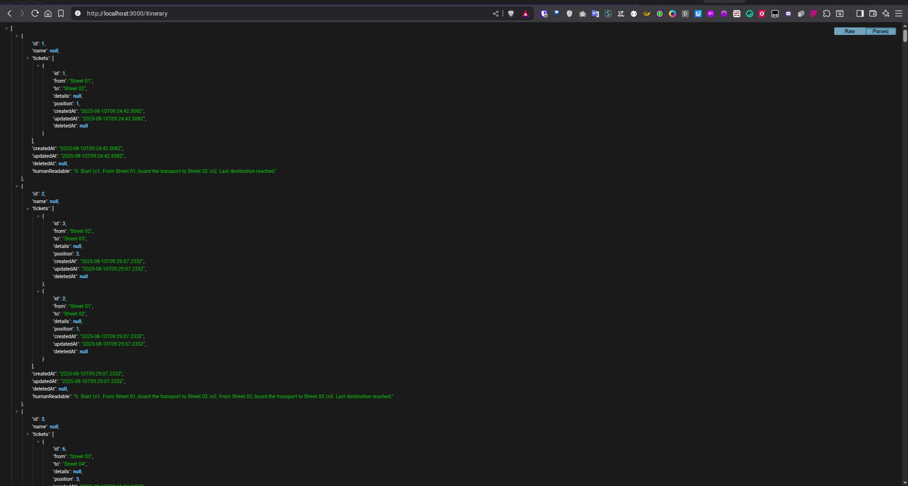
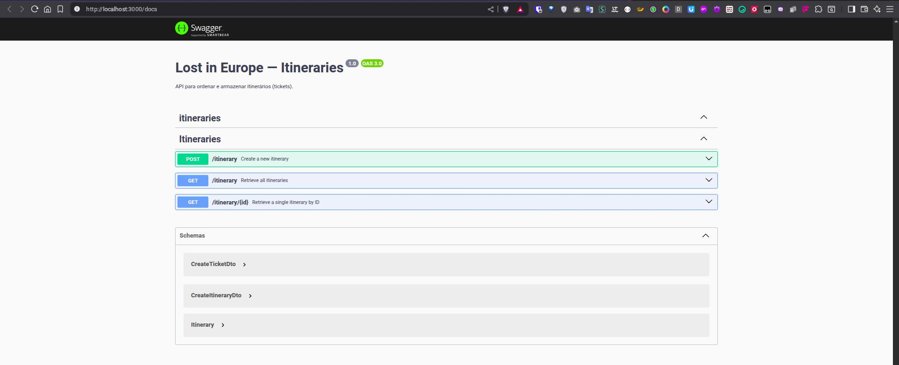
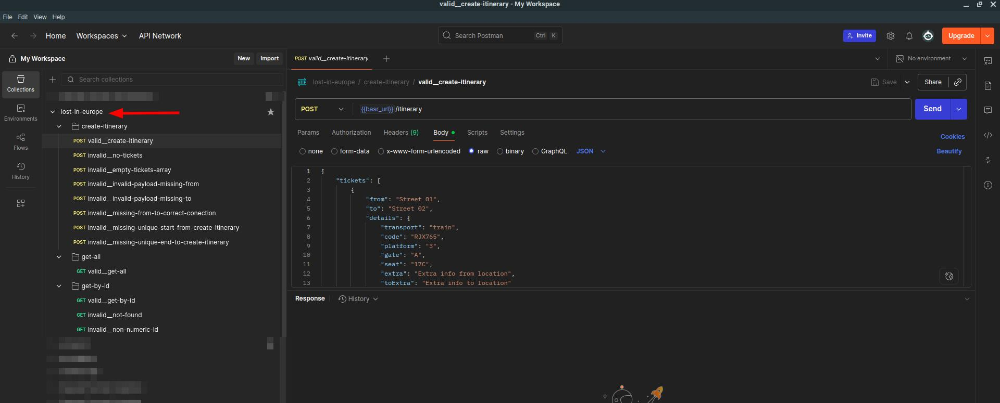

# Lost in Europe — Itineraries API

## Overview

The **Lost in Europe — Itineraries API** is a RESTful API built with **NestJS**, **TypeORM**, and **PostgreSQL**, designed to manage and sort travel itineraries. It allows users to create, retrieve, and view itineraries with detailed ticket information, including transportation type, platform, gate, seat, and more. The API generates human-readable descriptions for itineraries and is documented with **Swagger** and a **Postman collection** for easy exploration and testing. The application is containerized using **Docker** and uses **Docker Compose** for local development and testing.

| Resource              | URL / Path                                                                                             | Preview |
|-----------------------|-------------------------------------------------------------------------------------------------------|---------|
| **Base URL**          | [http://localhost:3000](http://localhost:3000/itinerary)                                                                               |         |
| **Swagger Docs**      | [http://localhost:3000/docs](http://localhost:3000/docs)                                              |  |
| **Postman Collection**| [./docs/postman/lost-in-europe.postman_collection.json](./docs/postman/lost-in-europe.postman_collection.json) |  |


## Table of Contents

- [Prerequisites](#prerequisites)
- [Installation](#installation)
- [Environment Configuration](#environment-configuration)
- [Running the Application](#running-the-application)
- [API Endpoints](#api-endpoints)
  - [Create a New Itinerary](#1-create-a-new-itinerary)
  - [Retrieve All Itineraries](#2-retrieve-all-itineraries)
  - [Retrieve a Single Itinerary](#3-retrieve-a-single-itinerary)
- [Schemas](#schemas)


## Prerequisites

To run the application locally, ensure you have the following installed:

- **Docker** (with Docker Compose support)
- **Node.js** (v16 or higher, for development purposes)
- **Git** (to clone the repository)

## Installation

1. **Clone the Repository**:
   ```bash
   git clone https://github.com/stdioh321/nestjs-lost-in-europe.git
   cd lost-in-europe
   ```

2. **Set Up the Environment**:
   The application uses a `.env` file for configuration. A sample file (`lost-in-europe/.env.example`) is provided. The `start.sh` script automatically creates a `.env` file if it doesn't exist.

3. **Verify Docker Installation**:
   Ensure Docker and Docker Compose are installed:
   ```bash
   docker --version
   docker compose version
   ```
   If Docker Compose is not available, install it or use the standalone `docker-compose` command.

## Environment Configuration

The `.env` file in the `lost-in-europe/` directory configures the application. Key variables include:

- `DATABASE_HOST`: Database host (default: `db`)
- `DATABASE_PORT`: Database port (default: `5432`)
- `DATABASE_NAME`: Database name (default: `lost_dev`)
- `DATABASE_USER`: Database user (default: `postgres`)
- `DATABASE_PASSWORD`: Database password (default: `postgres`)

To customize, edit `lost-in-europe/.env` after it’s created by the `start.sh` script.

## Running the Application

1. **Start the Application**:
   Use the provided `start.sh` script to launch the services:
   ```bash
   bash start.sh
   ```
   This script:
   - Checks for Docker and Docker Compose.
   - Creates a `.env` file from `.env.example` if missing.
   - Builds and starts the **PostgreSQL** (`db`) and **NestJS** (`app`) services using `docker-compose.yaml`.

2. **Access the Application**:
   - **API**: `http://localhost:3000`
   - **Swagger UI**: `http://localhost:3000/docs`

3. **Stop the Application**:
   To stop the containers:
   ```bash
   docker compose down
   ```

## API Endpoints

### 1. Create a New Itinerary
- **Endpoint**: `POST /itinerary`
- **Description**: Creates an itinerary with sorted tickets based on the provided data.
- **Request Body**:
  ```json
  {
    "name": "My Trip",
    "tickets": [
      {
        "from": "Street 01",
        "to": "Street 02",
        "details": {
          "transport": "train",
          "code": "RJX765",
          "platform": "3",
          "gate": "A",
          "seat": "17C",
          "extra": "Extra info from location",
          "toExtra": "Extra info to location",
          "others": "Something"
        }
      },
      {
        "from": "Street 02",
        "to": "Street 03"
      }
    ]
  }
  ```
- **Responses**:
  - `201 Created`: Returns the created itinerary.
  - `400 Bad Request`: Invalid input data.
  - `500 Internal Server Error`: Server-side error.

### 2. Retrieve All Itineraries
- **Endpoint**: `GET /itinerary`
- **Description**: Retrieves a list of all itineraries with tickets and human-readable descriptions.
- **Responses**:
  - `200 OK`: Returns the list of itineraries.
    ```json
    [
      {
        "id": 1,
        "name": "My Trip",
        "tickets": [
          {
            "id": 1,
            "from": "Street 01",
            "to": "Street 02",
            "details": null,
            "position": 1,
            "createdAt": "2025-08-10T12:24:42.508Z",
            "updatedAt": "2025-08-10T12:24:42.508Z",
            "deletedAt": null
          }
        ],
        "humanReadable": "0. Start.\n1. From Street 01, board the transport to Street 02.\n2. Last destination reached.",
        "createdAt": "2025-08-10T12:24:42.508Z",
        "updatedAt": "2025-08-10T12:24:42.508Z",
        "deletedAt": null
      }
    ]
    ```
  - `500 Internal Server Error`: Server-side error.

### 3. Retrieve a Single Itinerary
- **Endpoint**: `GET /itinerary/{id}`
- **Description**: Retrieves an itinerary by ID, including tickets and a human-readable description.
- **Parameters**:
  - `id` (path, number): Itinerary ID.
- **Responses**:
  - `200 OK`: Returns the itinerary.
    ```json
    {
      "id": 9,
      "name": "My Trip",
      "tickets": [
        {
          "id": 104,
          "from": "Street 01",
          "to": "Street 02",
          "details": {
            "transport": "train",
            "code": "RJX765",
            "platform": "3",
            "gate": "A",
            "seat": "17C",
            "extra": "Extra info from location",
            "toExtra": "Extra info to location"
          },
          "position": 1,
          "createdAt": "2025-08-10T16:25:30.006Z",
          "updatedAt": "2025-08-10T16:25:30.006Z",
          "deletedAt": null
        }
      ],
      "humanReadable": "0. Start.\n1. Board train - RJX765, Platform 3 - Gate A from Street 01 to Street 02 (Extra info to location). Seat number 17C, Extra info from location\n2. Last destination reached.",
      "createdAt": "2025-08-10T16:25:30.006Z",
      "updatedAt": "2025-08-10T16:25:30.006Z",
      "deletedAt": null
    }
    ```
  - `404 Not Found`: Itinerary not found.
  - `500 Internal Server Error`: Server-side error.

## Schemas

- **CreateTicketDto**:
  - `from` (string, required): Starting location.
  - `to` (string, required): Destination location.
  - `details` (object, optional): Additional travel details (e.g., `transport`, `code`, `platform`, `gate`, `seat`, `extra`, `toExtra`).

- **CreateItineraryDto**:
  - `name` (string, required): Itinerary name.
  - `tickets` (array, required): Array of `CreateTicketDto` objects.

- **Itinerary**:
  - Includes itinerary metadata (`id`, `name`, `createdAt`, `updatedAt`, `deletedAt`), an array of tickets, and a `humanReadable` description.
